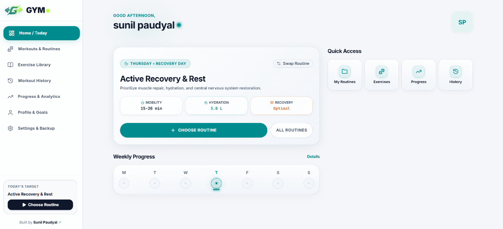
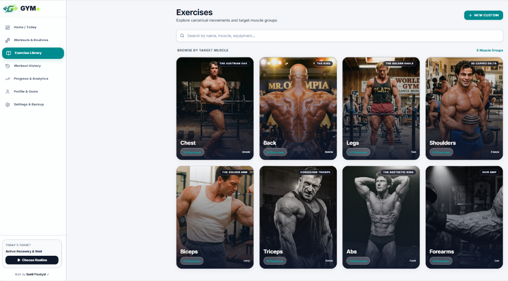
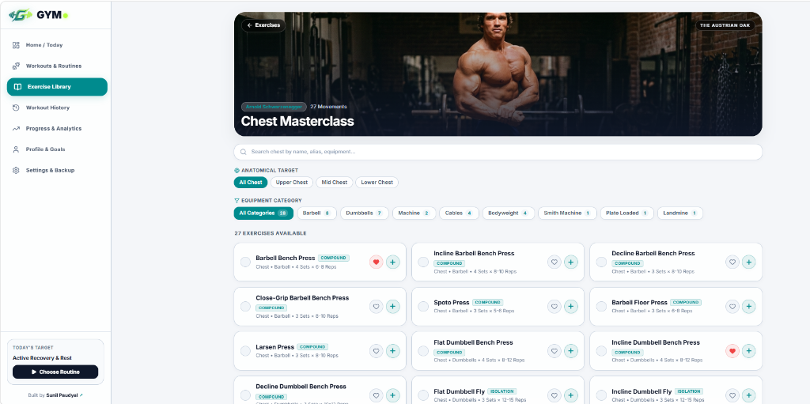
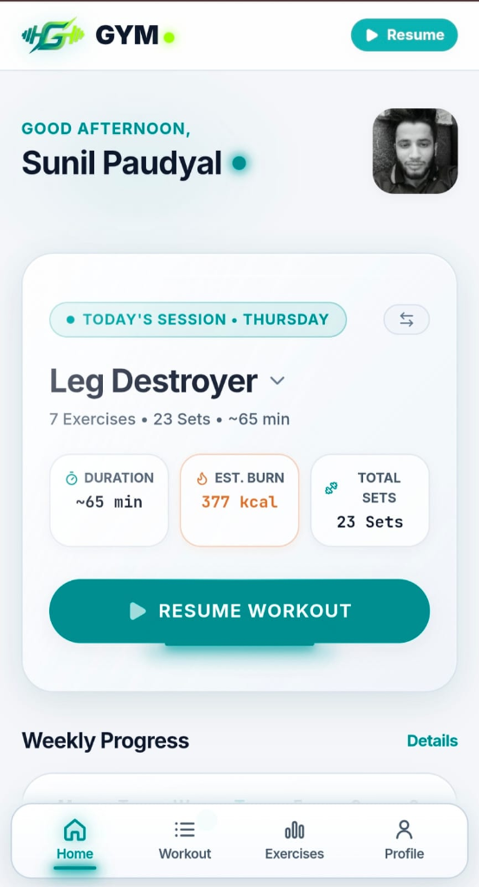

# GYM — High-Performance Local-First Workout Tracker & Telemetry System

<div align="center">


### **The Private, Account-Free, 60fps Offline Workout Engine**

[](https://sunilpaudyal.com.np)
[](LICENSE)
[](https://github.com/sunilpaudyal18/Gymlog)
[](https://www.typescriptlang.org/)

</div>

---

## Overview

**GYM** is an ultra-responsive, local-first progressive web application (PWA) designed for serious lifters, bodybuilders, and athletes. Built from the ground up to eliminate forced account logins, paywalls, and bloated server latency, **GYM** stores 100% of your training volume, routines, and telemetry directly in your client browser.

Whether lifting in a basement with zero cellular reception or flying across timezones, your routines, exercise library, rest timers, and personal records function flawlessly offline at a steady 60 frames per second.

---

## Visual Tour & Interface

<div align="center">

### Desktop Athlete Command Center
*Dynamic Day-of-the-Week Schedule, Rest Day Recovery Metrics & Quick Access*


---

### Muscle Library & Golden Era Categorization
*Curated canonical movements across 8 muscle groups with legendary athlete masterclasses*


---

### Masterclass Anatomical & Equipment Filtering
*Targeted sub-muscle isolation (Upper/Mid/Lower) and multi-equipment filtering*


---

### Mobile-First Workout Execution
*Tactile card layouts, live session resume pills, and quick routine hot-swapping*
<br/>


</div>

---

## Core System Features

### 1. 100% Local-First & Completely Offline
* **Zero Account Required**: Start tracking immediately upon opening the URL. No email verification, no passwords, no subscriptions.
* **Client-Side Persistence**: Workouts, custom routines, exercise history, and personal records persist seamlessly in `localStorage` and client caches.
* **Offline Service Worker (PWA)**: Full offline service worker caching ensures the app loads instantaneously on iOS Safari, Android Chrome, and Desktop browsers even in airplane mode.
* **Instant JSON Backup & Restore**: Export your complete training database into an uncompressed, human-readable JSON file at any time with one click, or import previous backups with zero data loss.

---

### 2. Dynamic Day-of-the-Week Split Scheduler
* **Calendar Engine**: Automatically calculates the athlete's current day of the week (Monday through Sunday) using client local timezone time.
* **Default Weekly Periodization**:
  * **Monday**: Chest + Triceps Focus (`chest-triceps-focus`)
  * **Tuesday**: Push Day Workout (`push-day-workout`)
  * **Wednesday**: Pull Day Focus (`pull-day-focus`)
  * **Thursday**: Leg Destroyer (`leg-destroyer`)
  * **Friday**: Chest + Triceps Focus (`chest-triceps-focus`)
  * **Saturday**: Active Recovery & Mobility (Rest Day)
  * **Sunday**: Full Rest & Muscle Repair (Rest Day)
* **Interactive Hot-Swap Modal**:
  * Switch any day's routine on the fly or mark today as a Rest Day.
  * Layered at `z-[100]` with a mobile drag handle and safe-area padding to eliminate navigation bar clipping.
  * Active split highlighted with an Electric Teal accent bar (`border-l-[4px] border-l-[#008B8E]`).
  * Live workout protection prompt: If a session is in progress with completed sets, the engine requests confirmation before discarding ongoing lifts.

---

### 3. Unified Session State & Live Navigation Sync
* **Single Source of Truth (`useTodaySession`)**: All components across the application consume a unified reactive state (`status`, `isRestDay`, `activeSession`, `routineName`, `todayRoutine`).
* **Synchronized Indicators**:
  * Desktop sidebar dynamically switches between `WORKOUT IN PROGRESS (Resume Session)` and `TODAY'S TARGET (Start Workout / Choose Routine)`.
  * Mobile header displays a pulsing `Resume` button only when an active workout is underway.
  * Bottom navigation pings the Workout tab when lifting and cleanly dismisses all live badges on Rest Days.

---

### 4. Canonical Exercise Library & Legendary Masterclasses
* **8 Curated Muscle Groups**:
  * **Chest**: Arnold Schwarzenegger (*The Austrian Oak*) — 27 canonical movements
  * **Back**: Ronnie Coleman (*The King*) — 30 canonical movements
  * **Legs**: Tom Platz (*The Golden Eagle*) — 45 canonical movements
  * **Shoulders**: Franco Columbu (*3D Capped Delts*) — 22 canonical movements
  * **Biceps**: Larry Scott (*The Golden Arm*) — 14 canonical movements
  * **Triceps**: Dorian Yates (*Horseshoe Triceps*) — 15 canonical movements
  * **Abs**: Frank Zane (*The Aesthetic King*) — 20 canonical movements
  * **Forearms**: Lee Priest (*Iron Grip*) — 14 canonical movements
* **Anatomical Target Filters**: Instant sub-muscle filtering (e.g. Upper Chest, Mid Chest, Lower Chest).
* **Equipment Categories**: Multi-select filtering across Barbell, Dumbbells, Machine, Cables, Bodyweight, Smith Machine, Plate Loaded, and Landmine.
* **Custom Movement Creation**: Add custom exercises with target sets, rep ranges, and movement type classifications (Compound vs. Isolation).

---

### 5. Progress & Analytics Telemetry Dashboard (`/progress`)
* **Key Metric KPI Strip**:
  * **60fps Count-Up Number Tickers**: Animated telemetry numbers mounted via `requestAnimationFrame`.
  * **Dynamic Micro Sparklines**: Inline SVG volume curves in Performance Teal (`#008B8E`).
  * **Radial Weekly Completion Ring**: Circular SVG meter tracking weekly workouts against your frequency target (e.g. 80% Target).
* **Interactive Weekly Consistency Heatmap**:
  * 7-day Monday–Sunday activity matrix.
  * Today highlighted with an **Electric Volt (`#B4FF39`) pulse ring** and neon under-glow.
  * Interactive hover/touch popovers displaying session routine, total tonnage, sets, and training duration.
* **Strength Telemetry SVG Chart**:
  * Area line graph with gradient fill and peak volt markers.
  * Filter by exercise (Bench Press, Squat, Deadlift, Overhead Press).
  * Hover crosshair inspection tracking absolute load and estimated 1RM.
  * **Ghost Projection Empty State**: Dashed projections encouraging consistency when data points are sparse.
* **Personal Record (PR) Trophy Board**:
  * Tiered energy badges for Gold, Amber, and Slate milestones.
  * **"New PR" Flash Badge**: Shimmering energy pill on records broken within the last 14 days.
  * **Tap-to-Inspect Progression Modal**: Displays complete historical timeline of all attempts with calculated 1RM estimations.

---

### 6. Splash Screen / Boot Loader
* **Hardware-Accelerated Launch**: Fullscreen AMOLED/Deep Slate overlay (`fixed inset-0 z-[9999] bg-[#0F172A]`).
* **Kinetic Floating Mark**: Floating "Kinetic G Barbell" glyph with vertical float (`translateY(-6px)` to `translateY(6px)` over 2.2s `ease-in-out`).
* **Pulsing Ambient Glow**: Dual radial glow in Electric Volt (`#B4FF39`, opacity: 0.18) and Performance Teal (`#008B8E`).
* **Traveling Energy Line**: Linear progress track with traveling Electric Volt streak.
* **Stepping Telemetry Messages**: Sequential status indicators in JetBrains Mono (`INITIALIZING TELEMETRY...` → `SYNCHRONIZING SPLIT...` → `CALIBRATING SENSORS...` → `SYSTEM READY`).
* **Seamless Opacity Exit**: 400ms cubic-bezier fade-out and complete DOM unmount with zero residual layout shift.

---

## Design System & Brand Palette

The user interface follows the **"Kinetic G Barbell"** design tokens:

| Token | Hex Code | Role | Description |
| :--- | :--- | :--- | :--- |
| **Performance Teal** | `#008B8E` | Primary Brand | Primary buttons, active tabs, volume charts, and focus highlights |
| **Electric Volt** | `#B4FF39` | Kinetic Accent | Active day pulse rings, peak markers, and energy indicators |
| **Burnt Amber** | `#D96B27` | Energy Accent | Workload metrics, calories, PR trophies, and swap badges |
| **Deep Slate** | `#0F172A` | Dark Neutral | Dark typography, dark CTA buttons, and splash screen canvas |
| **Light Quartz** | `#F4F6F9` | Light Base | Background canvas, crisp glass card backdrops, and subtle borders |

---

## Tech Stack

* **Framework**: React 19 + TypeScript (Strict Mode)
* **Bundler & Tooling**: Vite 6
* **Styling**: Vanilla CSS + Tailwind CSS (Utility tokens and CSS keyframes)
* **State Management**: Zustand (Local-first persisted stores with storage partitioning)
* **Icons**: Lucide React
* **Typography**: Inter (UI & Headings) + JetBrains Mono (Telemetry & Metrics)
* **PWA & Offline**: Custom Service Worker + Web App Manifest

---

## Getting Started

### Prerequisites
* [Node.js](https://nodejs.org/) (v18.0.0 or higher recommended)
* `npm` or `pnpm` or `yarn`

### Installation

```bash
# Clone the repository
git clone https://github.com/sunilpaudyal18/Gymlog.git

# Navigate into project directory
cd Gymlog

# Install dependencies
npm install

# Launch local development server
npm run dev
```

Visit `http://localhost:5173` in your browser.

### Production Build

```bash
# Type check and build production bundle
npm run build

# Preview production build locally
npm run preview
```

---

## Creator & Attribution

Designed, engineered, and maintained with obsession by **Sunil Paudyal**:

* **Portfolio**: [sunilpaudyal.com.np](https://sunilpaudyal.com.np)
* **GitHub**: [@sunilpaudyal18](https://github.com/sunilpaudyal18)

---

## License

This project is licensed under the [MIT License](LICENSE). Feel free to fork, customize, and build upon it!
